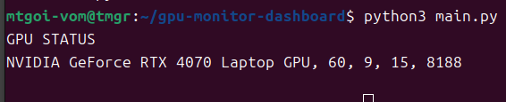

# GPU Monitor Dashboard

## Overview
GPU使用率・温度・VRAMを監視するPythonツール。

## Features
- GPU usage monitor
- Temperature monitor
- VRAM monitor
- NVIDIA-SMI support

## Environment
- Ubuntu
- Python 3
- NVIDIA Driver
- RTX 4070 Laptop GPU

## Run

```bash
python main.py

```
## Docker

``` bash
docker build -t gpu-monitor .
docker run --gpus all gpu-monitor
```

## Example Output

```txt
GPU STATUS
NVIDIA GeForce RTX 4070 Laptop GPU, 54, 9, 15, 8188
```

## Future Improvements
- Discord通知
- Docker対応
- Web UI
- FastAPI

## Screenshot


